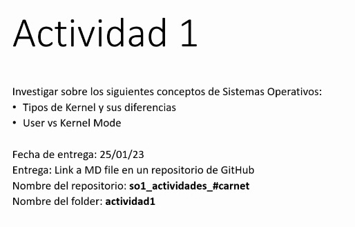
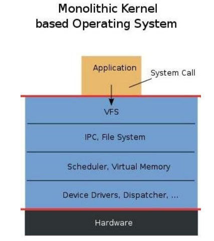
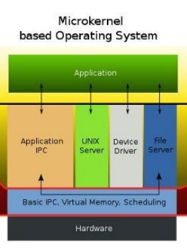
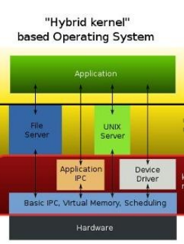
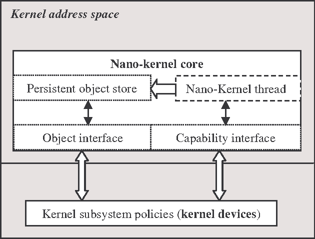
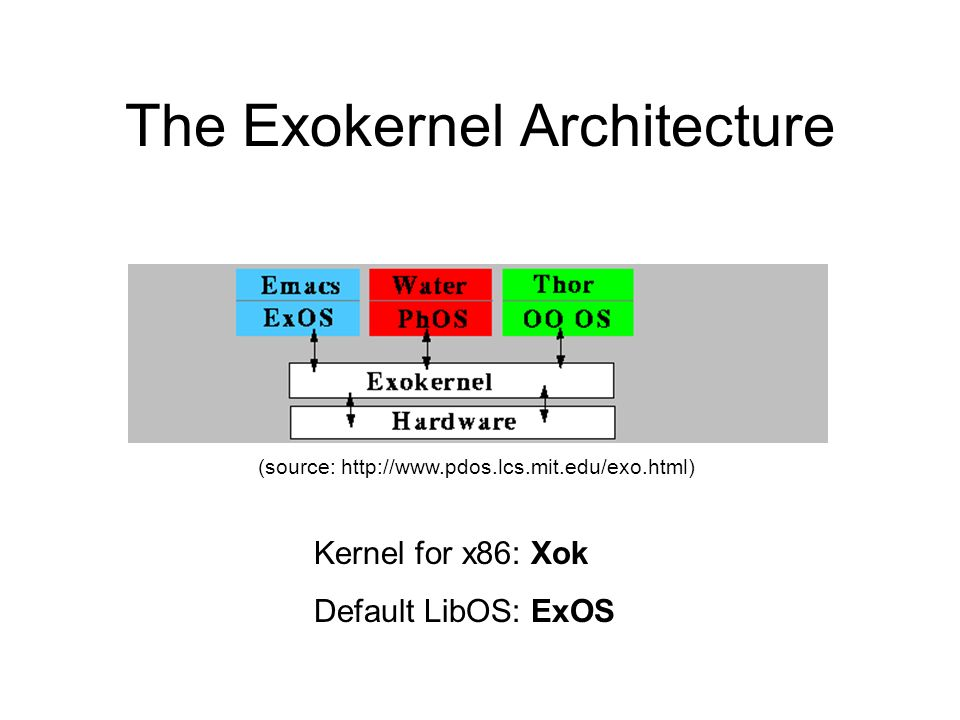

# ACTIVIDAD 1 - 201807316

Tipos de Kernel y sus Diferencias
=======

Hay cinco tipos "principales" de núcleos o arquitectura de sistema operativo son los siguientes.

## 1. Kernel Monolítico

Es el tipo de kernel mas simple y comun. Incluyen la funcionalidad central del sistema operativo y admiten todos los disòsitivos conectados a él. Los servicios de usuario y kernel se implementan en el mismo espacio de memoria. Por esto el tamaño del nucleo aumenta y por ende el tamaño del sistema operativo támbien. Su principal beneeficio es que en ejecucion el proceso es mas rapìdo ya que no hay espacio de memoria separado para el usuario y el kernel. 
## 2. Microkernel

Desarrollo mas "nuevo" y no son tan comunes como los monoliticos. Incluyen solamente servicios y dispositivos esenciales necesarios para que el sistema funcione. Esto da como resultado un kernel pequeño y compacto que usa menos memoria. El usuario y kernel se implementan en espacios distintos. Esto como consecuencia reduce el tamaño del kernel y da como resultado la reduccion del tamaño del sistema operativo.

## 3. Kernel Hibrido

Estos combinan monoliticos y microkernels. Incluyen mas servicios que microkernels pero menos que nucleos monoliticos. Esto permite tener beneficios de ambos tipos de kernels. La combinacion toma la velocidad de los monoliticos y modularidad de los microkernels.

## 4. Nano Kernel

Tipo mas pequeño de kernel. Consta soamente de miles de lineas de codigo (pequeña para ser de este campo). Esto implica que el codigo ejecutado en el hardware se ejecuta con el minimo. Se utilizan recursos limitados.

## 5. Exo Kernel

Tiene proteccion y gestion de recursos por separado. Es adecuado para cuando se hace un personalizacion en una aplicacion. Se usan mas en ambitos como dispositivos moviles. Es como un microkernel pero con caracteristicas especificamente para dispositivos moviles.